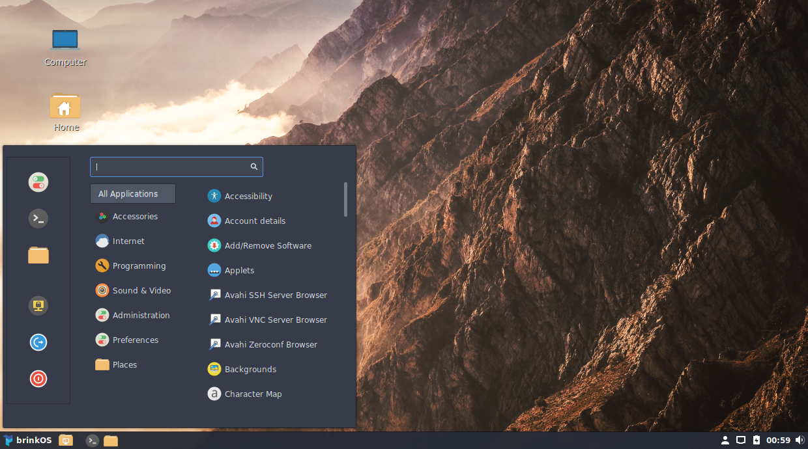
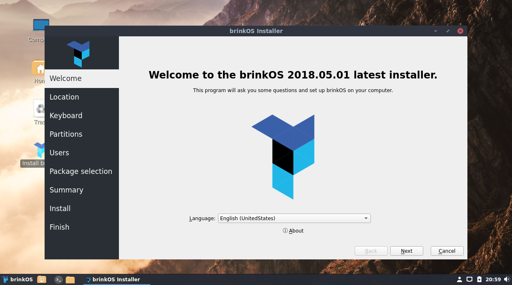

# brinkOS 

**THIS PROJECT IS CURRENTLY DEFUNCT BUT WILL RETURN SOON**  
*Existing ISO images will still work and install, but `brinkOS` packages are no longer maintained.*  

## About

This is an experimental distribution based off of Arch Linux. It is targeted for Developers/Engineers.
Currently the only supported platform is **x86_64**


Live ISO images are available under the [releases](https://github.com/brinkOS/brinkOS/releases) section of this repo.


### Cinnamon Desktop  


### Installer  



## Current State

This is an ongoing project, there are plenty of issues to be addressed. Most of the pre-build packages found in the brinkOS repository have been forked from AUR builds. I need to get these builds setup to always be up to date and synced.  

This distro is good if you are looking for an arch based system with a desktop and installer ready to go. It was initially inspired from the now defunct ApricityOS.  


## Goals

* Provide a live image with easy to use installer.
* Provide a beautiful and useful desktop environment.
* Provide a set of useful packages out of the box for developers/engineers.
* Provide a pre-built packages that may not be available in the official repositories such as vscode.


## Building
The following commands all assume you have cloned this repo and it is your current working directory.

Build the brinkOS build container.

```shell
docker build -t brinkos .
```

Build brinkOS, this will run and place the iso image in `./iso/`

```shell
$ docker run -i -t --privileged -v `pwd`/iso:/iso --rm brinkos
```

To optionally interact with the build process
```shell
$ docker run -i -t --privileged -v `pwd`/iso:/iso --rm brinkos bash
[root@dc1f5b1f676f /]# cd /build/archlive/
[root@dc1f5b1f676f archlive]# ./build.sh -v
```

## License

GPLv2

pacstrap.sh and arch install scripts are GPLv2 and all credit goes to original developers and maintainers.
see license directory. upstream URL [https://git.archlinux.org/arch-install-scripts.git/](https://git.archlinux.org/arch-install-scripts.git/)  

Arch linux is licensed under GLPv2, please refer to the arch linux website for additional information.
[https://www.archlinux.org/](https://www.archlinux.org/)  


